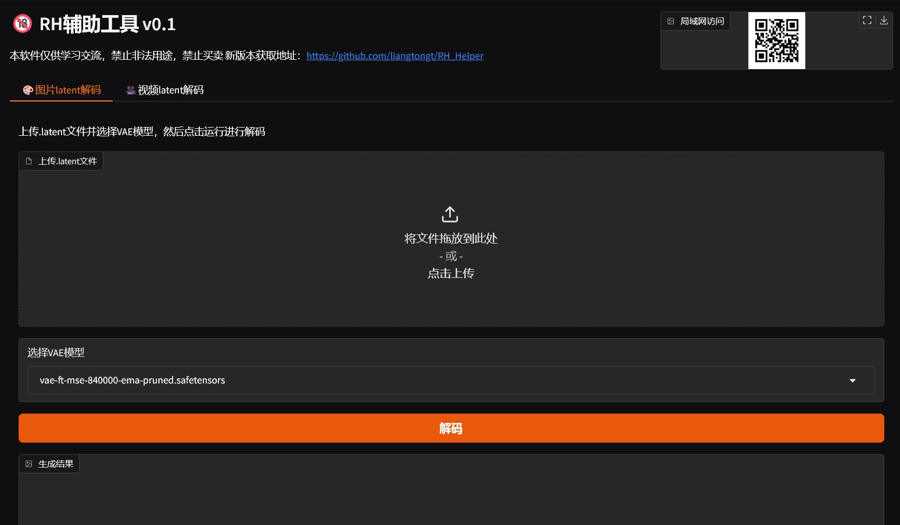
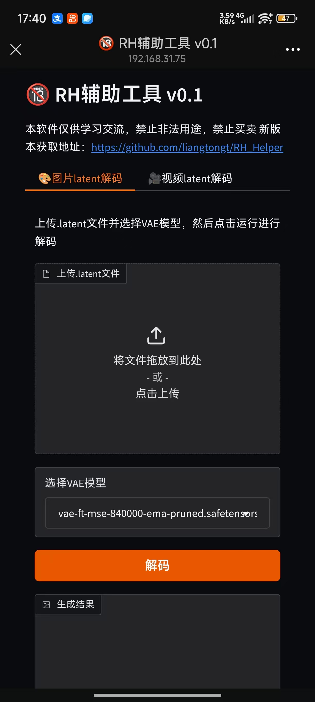
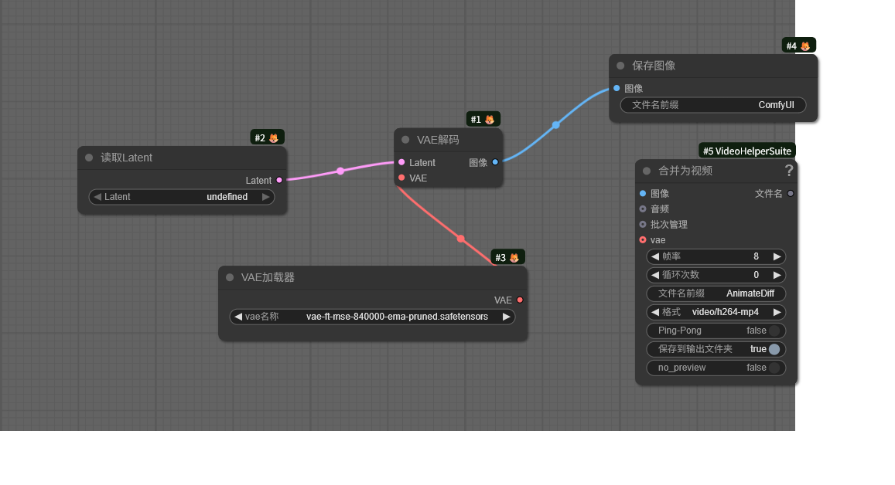

# 🔞 RH Helper

> 释放RH潜能的辅助工具，简单好用。
> 
>  helping tools to release RH potential. Simple and easy to use.


[](LICENSE)

[下载地址](https://github.com/comfyui/rh-helper/releases/latest)
[兼容的工作流](./wordflow_list.md)

## ✨ Features
- ⚡️ 简单：开箱即用
- 🔧 零配置：双击即可运行
- 🌍 PC端支持：Windows
- 📱 移动端支持：android/ios(需PC启动服务)

## 🚀 functions 
- 图片latent解码
- 视频latent解码
- 支持的工作流推荐
- 👨‍🚀其他功能欢迎提建议~

## 📚 Describe
压缩包比较大是因为已经集成好所有环境依赖和模型，双击即可享用。

目前版本仅支持CPU环境，后续会支持GPU环境，提高解码速度。

在对比了常见VAE模型后，选择了vae-ft-mse-840000-ema-pruned.safetensors 作为默认模型，解码速度较快，占用内存少。需要兼容其他模型可自行下载放于comfyui/models/vae文件夹下。


## 🏁 Quick Start
```bash
1、解压到任意目录
2、双击run.bat运行
```

## 界面
PC端：




移动端：




## comfyui大神版
有comfyui运行环境的大神可直接使用下述流程解码就行。


1、下载图片直接拖入comfyui即可加载流程

2、需解码latent文件放入ComfyUI/input文件夹下

## 流程创作者兼容
仅需在最后一步保存图片或视频时添加蓝框部分即可

可将兼容的流程链接通过issues提交，作者将会添加到兼容列表中。

## 免责说明
本软件仅供学习研究使用，请遵守当地相关法律法规，禁止用于任何商业用途，及非法用途，由此带来的法律责任与作者无关。
