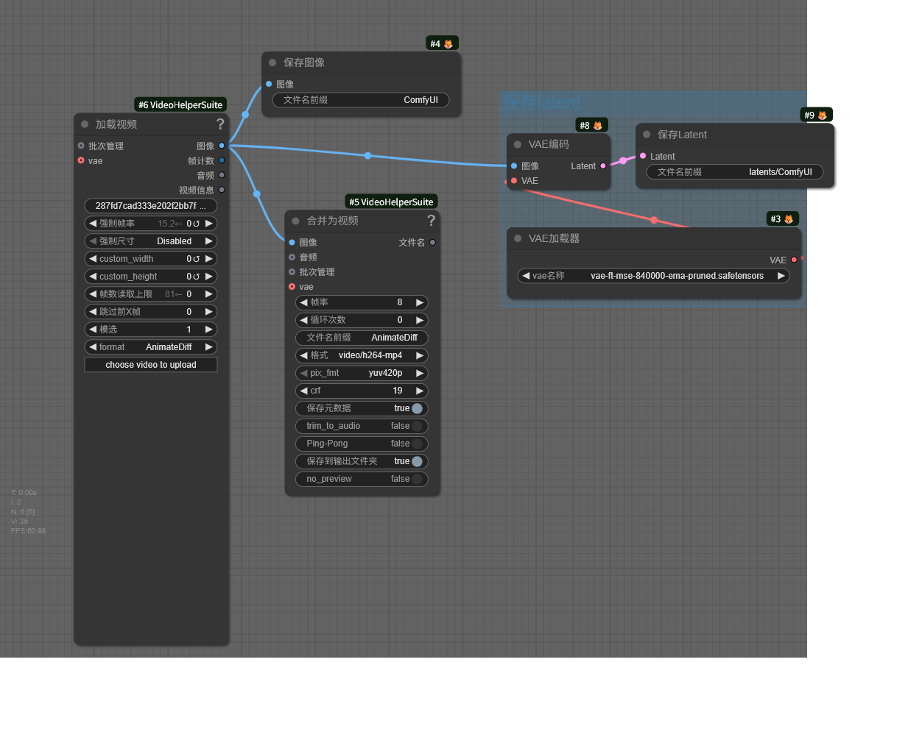

# 🔞 支持的工作流

> 不定时更新中。。。

## ✨ 文生图
| 名称 | 国内 | 海外 |
|-------|-------|-------|
| Qwen Image 破限制版 | [链接](https://www.runninghub.cn/ai-detail/1955818622205792257/?inviteCode=3ka31r8m) | [链接](https://www.runninghub.ai/ai-detail/1955818622205792257/?inviteCode=rh-v1068) |
| 待添加 | 链接 | 链接 |

## ✨ 图生视频
| 名称 | 国内 | 海外 |
|-------|-------|-------|
| WAN2.1 图生视频 自选lora 破限制版 | [链接](https://www.runninghub.cn/ai-detail/1956968437277757442/?inviteCode=3ka31r8m) | [链接](https://www.runninghub.ai/ai-detail/1956968437277757442/?inviteCode=rh-v1068) |
| 待添加 | 链接 | 链接 |

## 流程创作者兼容
仅需在最后一步保存图片或视频时添加蓝框部分即可

可将兼容的流程链接通过issues提交，作者将会添加到兼容列表中。

## 免责说明
本软件仅供学习研究使用，请遵守当地相关法律法规，禁止用于任何商业用途，及非法用途，由此带来的法律责任与作者无关。
